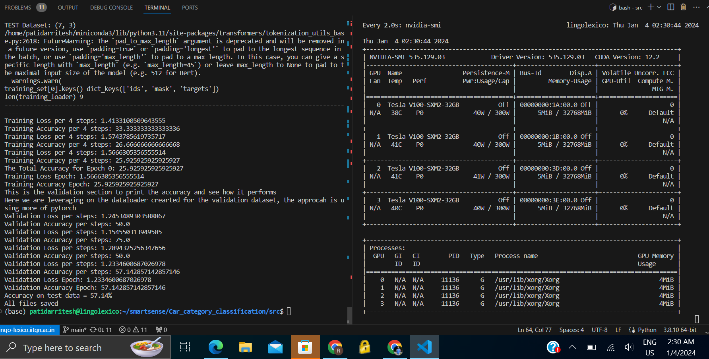

# Car_category_classification

### Final result : 57.14% accuracy in single epoch

## Car brochure pdf downloaded from : [https://www.carwale.com/]
* I went thorough few car selling websites and found that carwale.com has pdf brochures for each car category.
* I downloaded 10-10 pdf brochures for each category and extracted text from it.

## Dataset link : 
 * Pdf Link : [link](https://drive.google.com/drive/folders/1AUkZXLD82G3sx3xPPJbKnRNcU7CorUtM?usp=sharing)
 * Raw text link: [link](https://drive.google.com/drive/folders/17Ev2BRHX-kcnjPAsJ91q2KxxFDbS9p80?usp=sharing)
 * csv link: [link](https://drive.google.com/file/d/1Ih1zwLy_7Q70HXGIxLokAur2MoUXp9bJ/view?usp=sharing)

### Dataset Extraction from pdf brochure
* I used 'pypdf2' library to extract text from pdf brochure.
* Extracted text is converted to csv file using pandas library to its corresponding labels.
* `data_sheet.csv` is the final dataset file.it contains 2 columns : `text`,`folder_name`
* `text` column contains text extracted from pdf brochure.
* `folder_name` column contains the category of car brochure.

While extracting text from pdf brochure, I found that some of the pdf brochures are not in proper format. So I removed those pdf brochures from dataset using dropna().
This is my final dataset file feed to my model.

### Model used :- DistilBert
### why ?  
* DistilBERT is a distilled version of BERT (Bidirectional Encoder Representations from Transformers), offering a more lightweight architecture with reduced computational complexity. This is particularly advantageous for fine-tuning on a specific dataset, as it allows for quicker training times and lower resource requirements compared to larger models.
* Car brochures often contain domain-specific language, technical terms, and unique descriptions related to automotive features. DistilBERT, having been pre-trained on diverse textual data, can capture and understand such domain-specific nuances, making it well-suited for tasks related to car-related content.
* DistilBERT is also a good choice for this task because it is a smaller model, and thus requires less time and resources to train. This is especially important for this task, as the dataset is relatively small.

### Methodology :

* To fine-tune it for our car brochure dataset. The custom PyTorch module, DistillBERTClass, was crafted to integrate the pre-trained DistilBERT model, introducing a pre-classification linear layer and dropout for regularization, followed by a final classification layer.
* I configured key hyperparameters for training DistilBERT-based model. The MAX_LEN parameter was set to 512, determining the maximum sequence length of input tokens. For training,I used a batch size of 2 (TRAIN_BATCH_SIZE), and for validation, a batch size of 2 (VALID_BATCH_SIZE), optimizing the trade-off between computational efficiency and model performance. The model was trained for a single epoch (EPOCHS = 1), indicating one complete pass through the entire training dataset. The learning rate (LEARNING_RATE) was set to 3e-04 for controlling the step size during optimization. Additionally,I used the DistilBERT tokenizer to preprocess and tokenize the input text based on the 'distilbert-base-cased' pre-trained model.  
* DistilBERT outputs hidden states with dimensions (batch_size, sequence_length, hidden_size), where hidden_size is 768. A pre-classification linear layer processes the pooled representation, followed by ReLU activation and dropout. The final linear layer outputs predictions for 4 classes. This architecture ensures compatibility between layers and effective feature utilization for the classification task.

## Conclusion

* My fine-tuned DistilBERT model, configured with careful consideration of hyperparameters and architecture, achieved a test accuracy of **57.14%** only in single epoch. While the performance indicates a reasonable level of predictive capability, it also highlights the complexity and challenges associated with the car brochure classification task. Further optimization and experimentation, including adjusting hyperparameters, exploring alternative models, and potentially increasing the dataset size,traning it for more epochs could contribute to enhancing model performance. 

